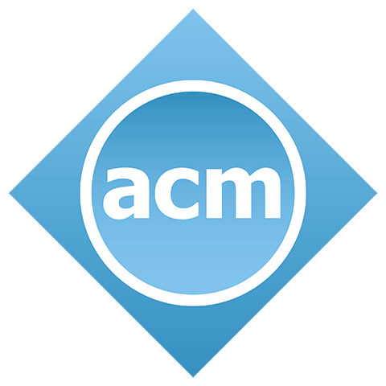

# ACM BITS Pilani Hyderabad Chapter Website



## Overview

This is the official website for the Association for Computing Machinery (ACM) student chapter at BITS Pilani Hyderabad Campus. The website serves as a hub for our chapter's activities, events, and resources, providing information about our mission, team, and initiatives.

## Features

-   **Modern UI/UX**: Built with Next.js and Tailwind CSS for a responsive and visually appealing experience
-   **Interactive Elements**: Animated components and transitions using Framer Motion
-   **Team Showcase**: Carousel displaying chapter leadership and team members
-   **Events Calendar**: Information about upcoming and past events
-   **FAQ Section**: Answers to common questions about ACM and chapter membership
-   **Responsive Design**: Optimized for all device sizes

## Tech Stack

-   [Next.js](https://nextjs.org/) - React framework for production
-   [React](https://reactjs.org/) - JavaScript library for building user interfaces
-   [Tailwind CSS](https://tailwindcss.com/) - Utility-first CSS framework
-   [Framer Motion](https://www.framer.com/motion/) - Animation library for React
-   [shadcn/ui](https://ui.shadcn.com/) - UI component library
-   [Lucide React](https://lucide.dev/) - Icon library

## Getting Started

### Prerequisites

-   Node.js 16.x or later
-   npm or yarn

### Installation

1. Clone the repository:

    ```bash
    git clone https://github.com/BPHC-ACM/acm-website.git
    cd acm-website
    ```

2. Install dependencies:

    ```bash
    npm install
    # or
    yarn install
    ```

3. Run the development server:

    ```bash
    npm run dev
    # or
    yarn dev
    ```

4. Open [http://localhost:3000](http://localhost:3000) with your browser to see the result.

## Project Structure

```
acm-website/
├── components/           # Reusable UI components
├── lib/                  # Utility functions and data
├── public/               # Static assets
└── app/                  # Next.js app router pages
```

## Key Components

-   `AnimatedTechBackground`: Creates the animated background effect
-   `TeamHeads`: Data for the team carousel
-   `FAQ Items`: Frequently asked questions and answers

## Contributing

We welcome contributions from ACM members and the wider community. To contribute:

1. Fork the repository
2. Create a feature branch
3. Make your changes
4. Submit a pull request

Please ensure your code follows our style guide and includes appropriate tests.

## License

This project is licensed under the MIT License - see the LICENSE file for details.

## Contact

For inquiries, please reach out to us via:

-   Email: acm@hyderabad.bits-pilani.ac.in
-   GitHub: [BPHC-ACM](https://github.com/BPHC-ACM)

## Acknowledgements

-   ACM Global for their continued support
-   BITS Pilani Hyderabad Campus administration
-   All our members and contributors
